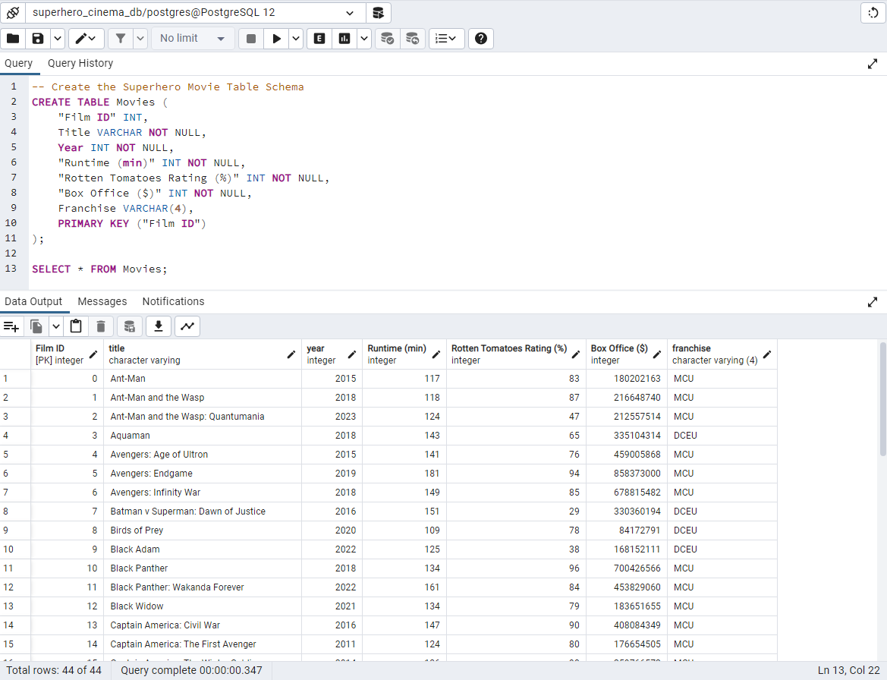

# MCU vs. DCEU
## Introduction
In this repository, I am practicing my data engineering and analysis skills by working on the topic of the MCU versus the DCEU.

## Overview
1. In a [Jupyter Notebook](data_collection.ipynb), I retrieved the data from OMDb API, created a Pandas DataFrame, checked and changed data types, and exported the data to a CSV file.

2. I created a [SQL schema](schema.sql), created a new database in PGAdmin, ran the schema code, and imported the CSV file into a new database.

3. I created a [Flask App](app.py) to create my own API.

## Next Steps
My next step for this project is to create a dashboard using HTML/CSS and JavaScript to analyze and visualize the data.

## Technologies
Technologies used in this project:
* Python
* Jupyter Notebook
* Requests
* Pandas
* SQL
* PostgreSQL
* SQLAlchemy
* Flask

## Attribution
Data was collected from OMDb API, The Open Movie Database at https://www.omdbapi.com/.